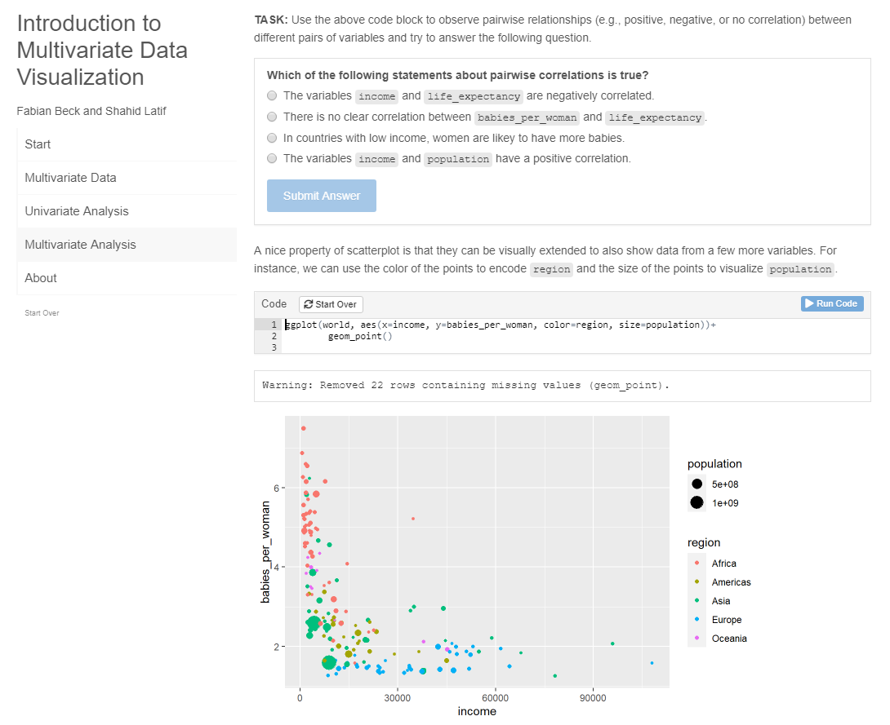

# Introduction to Multivariate Data Visualization
An introduction to data visualization that focuses on the explorative analysis of multivariate (tabular) data and uses interactive examples in R.

## How to run the interactive tutorial locally?
1. Download and install [R](https://www.r-project.org/) and [RStudio Desktop](https://www.rstudio.com/products/rstudio/).
2. Clone or download the repository.
3. Open `mv-vis.Rmd` in RStudio and click on **Run Document** to compile and run the interactive tutorial. On first execution, you may need to install required packages, especially `learnr`, `ggplot2`, and `GGally`.
4. The tutorial opens in a new RStudio window. You can click **Open in Browser** on the top left to view the tutorial in the default Web browser.

<kbd></kbd>

## View a non-interactive version of the tutorial or cite it

A PDF version without any interactions is available via Zenodo:

Fabian Beck & Shahid Latif. (2022, May 6). Introduction to Multivariate Data Visualization. Zenodo. https://doi.org/10.5281/zenodo.6523081

## Dataset
The dataset used throughout the tutorial is based on free material from [GAPMINDER.ORG](https://www.gapminder.org) (licensed under CC-BY LICENSE).

## About 

This tutorial has been written by Fabian Beck and Shahid Latif, with technical support by Denis Artjuch. We thank [DataCampus UDE](https://www.uni-due.de/ub/datacampus/index.php), a data literacy initiative by University of Duisburg-Essen, for partly funding the project.

### Contact

Prof. Dr. Fabian Beck

University of Bamberg

An der Weberei 5, 96047 Bamberg, Germany

fabian.beck(at)uni-bamberg.de
