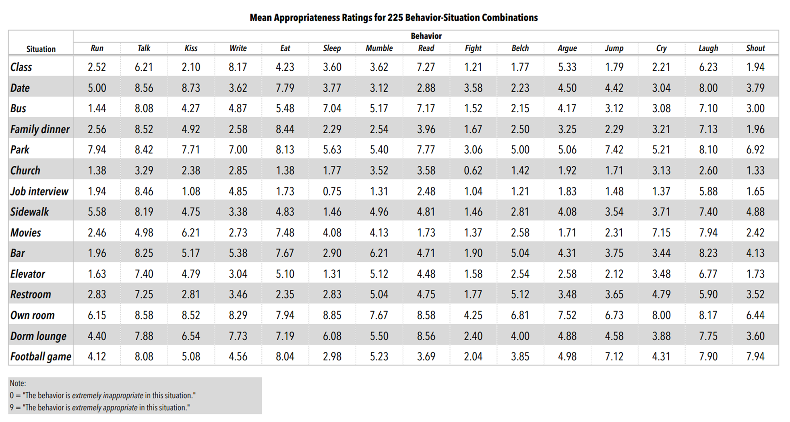
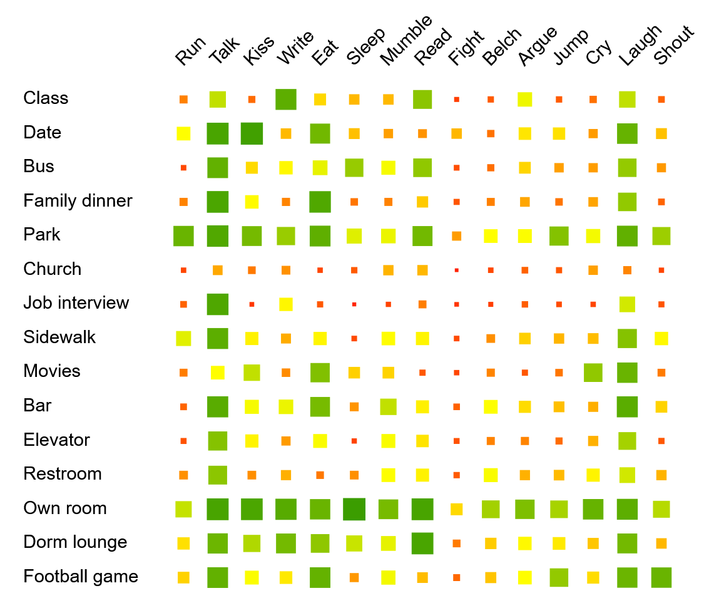

# Start

> This tutorial is an introduction to data visualization that focuses on the explorative analysis of multivariate (tabular) data. The tutorial is targeted at learners of all disciplines — no programming experience required.

## Motivation

The **goal of data visualization** is to make data readable. Whereas statistics focuses on summarizing data and testing hypotheses, visualization is more explorative. With a visualization, we can get an overview of the data, identify frequent patterns and rare outliers, inspect quality issues, and relate individual data points to the overall data. This is not meant to replace a statistical analysis, but to complement it.

In this tutorial, we focus on **multivariate data** — data that can be represented as tables — because it is one of the most common data types and its visualization is relevant across nearly all scientific areas and domains. The rows of the table usually list the data items, while the columns provide different data variables recorded for each item.

**Tables** in their plain version are a great tool to show small amounts of data, as well as to edit and transform the data. However, they hardly provide a good overview or reveal patterns and outliers.

## Example

For instance, the table below shows study results where participants answered **how appropriate a behavior is in a certain situation** (from 0 — *low* to 9 — *high appropriateness*). It is easy to read a specific value from the table relating to a pair of behavior and situation. An example is that *sleeping* in *church* is not considered appropriate (value: 1.77). But what is the most appropriate behavior in *church*? What is generally a favorable behavior in most situations? Are there other situations rated similarly to *church*? These questions are harder to answer with the plain table, already in this rather small example.

*Source: "Behavioral Appropriateness and Situational Constraint as Dimensions of Social Behavior", Price, R.H. and Bouffard, D.L., Journal of Personality and Social Psychology, 1974, Vol. 30, No.4, 579–586.*

By using colored squares as cells, we can **transform the table into a visualization**. We use orange for low values and green for high values. Additionally, we vary the sizes of the squares according to the appropriateness to make it even easier to read, also considering that some users might be red-green colorblind. This is a straightforward way to visualize multivariate data, but a quite powerful approach already. For instance, we can now see that *job interview* has very similar values as *church*, and opposite to that are *park* and *own room*.

This is just one example to motivate that the use of visualization can be a powerful tool for data analysis. There are also other visualization methods for such tabular data, some that scale to much larger datasets. We will explain some important ones in this tutorial step by step.

## Structure of this Tutorial

As the **main content of this tutorial**, we will introduce you to multivariate data and how to visualize such information. After clarifying the type of data ([Multivariate Data](/multivariate-data)), we will first look at visualizations that visualize the data from each variable separately ([Univariate Analysis](/univariate-analysis)). Then, we also discuss visualizations that show multiple variables at the same time ([Multivariate Analysis](/multivariate-analysis)). Along with introducing the visualization techniques, we will also discuss their advantages and limitations, as well as their potential to be misinterpreted or misused.

Using D3.js, all visualizations are rendered interactively in your browser. You can change variables and parameters using the controls beneath each chart, and answer the short quizzes to check your understanding.
